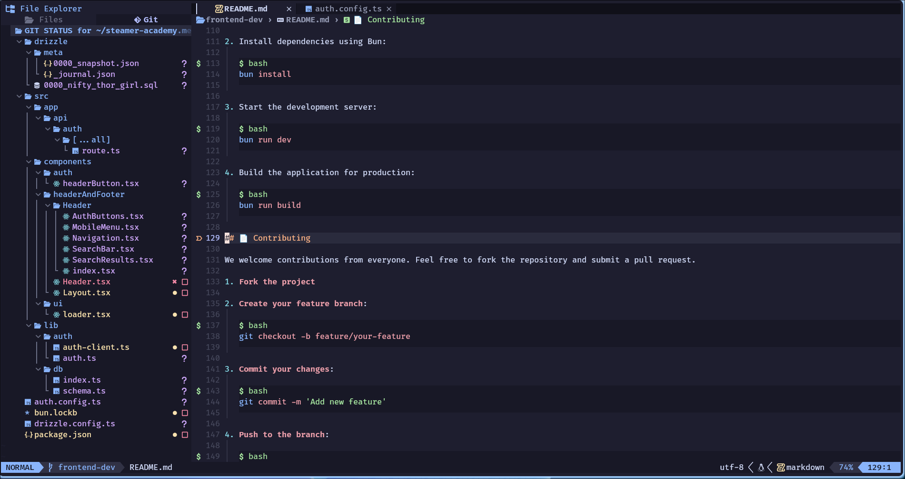
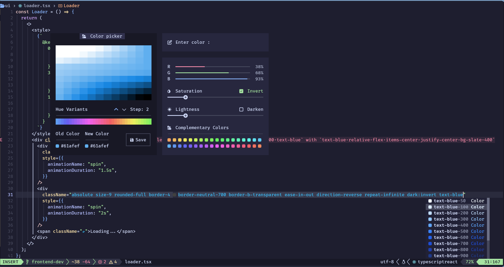
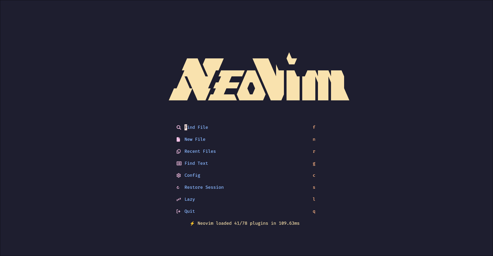
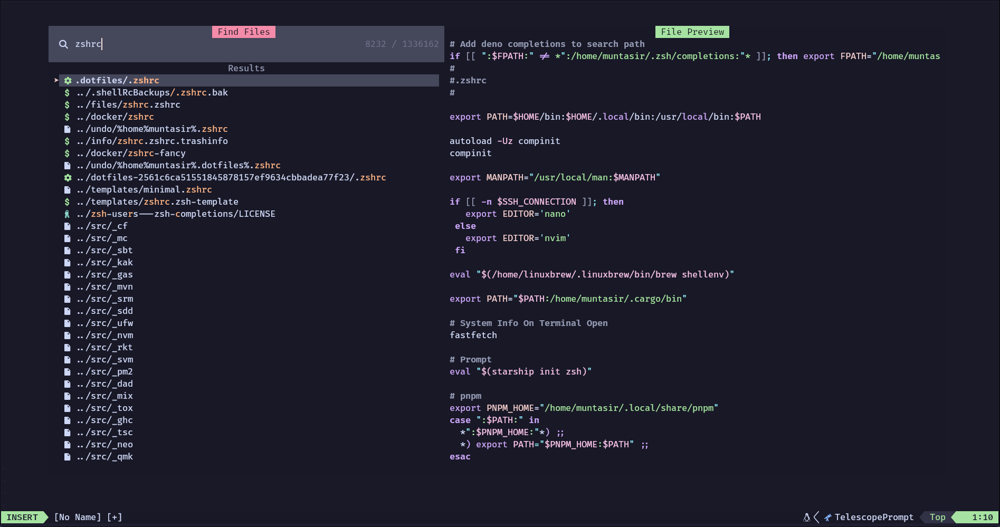
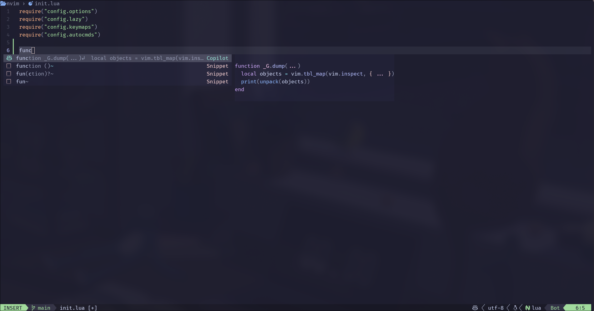
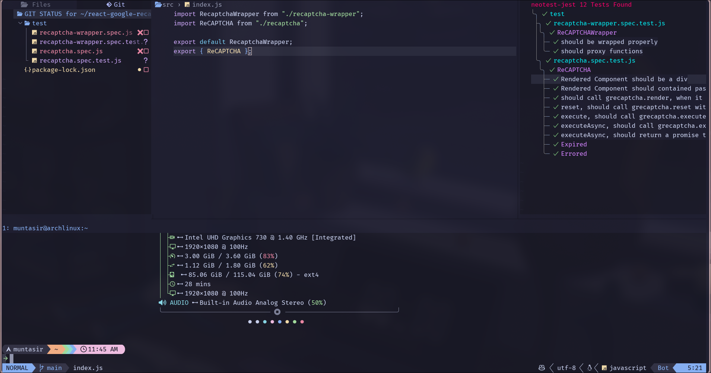

<h3 align="center"></h3>

<a href="https://dotfyle.com/MuntasirSZN/dotfiles-neovim-config-nvim"></a>
<a href="https://dotfyle.com/MuntasirSZN/dotfiles-neovim-config-nvim"></a>
<a href="https://dotfyle.com/MuntasirSZN/dotfiles-neovim-config-nvim"></a>

## Table Of Contents
<!--toc:start-->
- [:sparkles: Features Supported](#sparkles-features-supported)
- [:eyes: Showcase](#eyes-showcase)
- [:zap: Requirements](#zap-requirements)
- [:file_folder: File Structure](#file_folder-file-structure)
- [:star: Plugins](#star-plugins)
- [:rocket: Getting Started](#rocket-getting-started)
- [:wave: Credits](#wave-credits)
<!--toc:end-->
## :sparkles: Features Supported

- ⚡ The following languages and all other language support
  - Rust
  - HTML
  - Css
  - Tailwind
  - JavaScript
  - TypeScript
  - Lua
- 📦 Linters and static analysis through [none-ls](https://github.com/nvimtools/none-ls.nvim) and [mason.nvim](https://github.com/williamboman/mason.nvim)
- 🥂 Lsp servers configured with [nvim-lspconfig](https://github.com/neovim/nvim-lspconfig)
- 🧹 Autocompletion using the new [blink.cmp](https://github.com/saghen/blink.cmp)
- ⚒️ Testing using the fantastic [neotest](https://github.com/nvim-neotest/neotest) plugin
- 💫 Treesitter syntax highlighting
- 💤 Easily customize and extend config
- 🎨 A theme switcher using [themery.nvim](https://github.com/zaldih/themery.nvim)
- 📷 Take code screenshots using [nvim-silicon](https://github.com/michaelrommel/nvim-silicon)
- 🚀 Blazingly fast using [💤 lazy.nvim](https://github.com/folke/lazy.nvim)

## :eyes: Showcase

|  |  |
| ------- | ------- |
|  |  |
|  |  |

## :file_folder: File Structure

<details>

<summary> </summary>

```
    📂 ~/.config/nvim
    ├── 📂 lua
    │  └── 📂 config
    │  │   ├──  autocmds.lua
    │  │   ├──  keymaps.lua
    │  │   ├──  lazy.lua
    │  │   └──  options.lua
    │  └── 📂 custom
    │  │   └──  telescope-preview.lua
    │  └── 📂 plugins
    │      ├──  ai.lua
    │      ├──  annotations.lua
    │      ├──  auto-save.lua
    │      ├──  autopairs.lua
    │      ├──  autotag.lua
    │      ├──  bufferline.lua
    │      ├──  completions.lua
    │      ├──  context.lua
    │      ├──  cursor-highlight.lua
    │      ├──  dap.lua
    │      ├──  database.lua
    │      ├──  flash.lua
    │      ├──  git.lua
    │      ├──  grug-far.lua
    │      ├──  harpoon.lua
    │      ├──  icons.lua
    │      ├──  img-clip.lua
    │      ├──  indent-guides.lua
    │      ├──  lazydev.lua
    │      ├──  live-server.lua
    │      ├──  live-share.lua
    │      ├──  lsp.lua
    │      ├──  markdown.lua
    │      ├──  mdx.lua
    │      ├──  mini-textobjects.lua
    │      ├──  neogit.lua
    │      ├──  neotest.lua
    │      ├──  neotree.lua
    │      ├──  noice.lua
    │      ├──  nvchad.lua
    │      ├──  persistance.lua
    │      ├──  rust.lua
    │      ├──  screenshots.lua
    │      ├──  snacks.lua
    │      ├──  snippets.lua
    │      ├──  statusline.lua
    │      ├──  tailwind.lua
    │      ├──  telescope.lua
    │      ├──  theme.lua
    │      ├──  todo-comments.lua
    │      ├──  treesitter.lua
    │      ├──  trouble.lua
    │      ├──  ts-comments.lua
    │      ├──  undotree.lua
    │      ├──  vim-tmux-navigation.lua
    │      ├──  which-key.lua
    │      └──  yanky.lua
    │
    ├──  init.lua
    ├──  lazy-lock.json
    └──  README.md
```

- The [lua/config](./lua/config/) directory contains all of neovims autocommands, keymaps, [lazy.nvim](https://github.com/folke/lazy.nvim) config, and options.
- The [lua/plugins](./lua/plugins/) directory contains all plugin specific configuration.
- The [lazy-lock.json](./lazy-lock.json) is lazy.nvim package managers lockfile.
- The [images](./images) directory contains the images that are showcased above.
- The [init.lua](./init.lua) file is the starting point for the neovim configuration.
- The [Custom](./lua/custom) directory contains custom configurations for plugins.

</details>

## :star: Plugins

<details>

### ai

+ [olimorris/codecompanion.nvim](https://dotfyle.com/plugins/olimorris/codecompanion.nvim)
### color

+ [xzbdmw/colorful-menu.nvim](https://dotfyle.com/plugins/xzbdmw/colorful-menu.nvim)
+ [catgoose/nvim-colorizer.lua](https://dotfyle.com/plugins/catgoose/nvim-colorizer.lua)
### colorscheme

+ [catppuccin/nvim](https://dotfyle.com/plugins/catppuccin/nvim)
+ [folke/tokyonight.nvim](https://dotfyle.com/plugins/folke/tokyonight.nvim)
### colorscheme-switchers

+ [zaldih/themery.nvim](https://dotfyle.com/plugins/zaldih/themery.nvim)
### comment

+ [echasnovski/mini.comment](https://dotfyle.com/plugins/echasnovski/mini.comment)
+ [danymat/neogen](https://dotfyle.com/plugins/danymat/neogen)
+ [folke/todo-comments.nvim](https://dotfyle.com/plugins/folke/todo-comments.nvim)
+ [folke/ts-comments.nvim](https://dotfyle.com/plugins/folke/ts-comments.nvim)
### completion

+ [zbirenbaum/copilot.lua](https://dotfyle.com/plugins/zbirenbaum/copilot.lua)
+ [mikavilpas/blink-ripgrep.nvim](https://dotfyle.com/plugins/mikavilpas/blink-ripgrep.nvim)
### cursorline

+ [RRethy/vim-illuminate](https://dotfyle.com/plugins/RRethy/vim-illuminate)
### debugging

+ [theHamsta/nvim-dap-virtual-text](https://dotfyle.com/plugins/theHamsta/nvim-dap-virtual-text)
+ [mfussenegger/nvim-dap](https://dotfyle.com/plugins/mfussenegger/nvim-dap)
+ [rcarriga/nvim-dap-ui](https://dotfyle.com/plugins/rcarriga/nvim-dap-ui)
### diagnostics

+ [folke/trouble.nvim](https://dotfyle.com/plugins/folke/trouble.nvim)
### editing-support

+ [folke/snacks.nvim](https://dotfyle.com/plugins/folke/snacks.nvim)
+ [okuuva/auto-save.nvim](https://dotfyle.com/plugins/okuuva/auto-save.nvim)
+ [windwp/nvim-ts-autotag](https://dotfyle.com/plugins/windwp/nvim-ts-autotag)
+ [echasnovski/mini.splitjoin](https://dotfyle.com/plugins/echasnovski/mini.splitjoin)
+ [echasnovski/mini.move](https://dotfyle.com/plugins/echasnovski/mini.move)
+ [echasnovski/mini.operators](https://dotfyle.com/plugins/echasnovski/mini.operators)
+ [echasnovski/mini.ai](https://dotfyle.com/plugins/echasnovski/mini.ai)
+ [gbprod/yanky.nvim](https://dotfyle.com/plugins/gbprod/yanky.nvim)
+ [echasnovski/mini.basics](https://dotfyle.com/plugins/echasnovski/mini.basics)
+ [echasnovski/mini.pairs](https://dotfyle.com/plugins/echasnovski/mini.pairs)
+ [nvim-treesitter/nvim-treesitter-context](https://dotfyle.com/plugins/nvim-treesitter/nvim-treesitter-context)
### file-explorer

+ [echasnovski/mini.files](https://dotfyle.com/plugins/echasnovski/mini.files)
+ [nvim-neo-tree/neo-tree.nvim](https://dotfyle.com/plugins/nvim-neo-tree/neo-tree.nvim)
### fuzzy-finder

+ [nvim-telescope/telescope.nvim](https://dotfyle.com/plugins/nvim-telescope/telescope.nvim)
### git

+ [sindrets/diffview.nvim](https://dotfyle.com/plugins/sindrets/diffview.nvim)
+ [NeogitOrg/neogit](https://dotfyle.com/plugins/NeogitOrg/neogit)
+ [lewis6991/gitsigns.nvim](https://dotfyle.com/plugins/lewis6991/gitsigns.nvim)
### github

+ [ldelossa/gh.nvim](https://dotfyle.com/plugins/ldelossa/gh.nvim)
### icon

+ [nvim-tree/nvim-web-devicons](https://dotfyle.com/plugins/nvim-tree/nvim-web-devicons)
+ [echasnovski/mini.icons](https://dotfyle.com/plugins/echasnovski/mini.icons)
### indent

+ [lukas-reineke/indent-blankline.nvim](https://dotfyle.com/plugins/lukas-reineke/indent-blankline.nvim)
### keybinding

+ [folke/which-key.nvim](https://dotfyle.com/plugins/folke/which-key.nvim)
### lsp

+ [ldelossa/litee.nvim](https://dotfyle.com/plugins/ldelossa/litee.nvim)
+ [zeioth/none-ls-autoload.nvim](https://dotfyle.com/plugins/zeioth/none-ls-autoload.nvim)
+ [nvimdev/lspsaga.nvim](https://dotfyle.com/plugins/nvimdev/lspsaga.nvim)
+ [neovim/nvim-lspconfig](https://dotfyle.com/plugins/neovim/nvim-lspconfig)
+ [nvimtools/none-ls.nvim](https://dotfyle.com/plugins/nvimtools/none-ls.nvim)
+ [mrcjkb/rustaceanvim](https://dotfyle.com/plugins/mrcjkb/rustaceanvim)
### lsp-installer

+ [williamboman/mason.nvim](https://dotfyle.com/plugins/williamboman/mason.nvim)
### markdown-and-latex

+ [MeanderingProgrammer/render-markdown.nvim](https://dotfyle.com/plugins/MeanderingProgrammer/render-markdown.nvim)
+ [iamcco/markdown-preview.nvim](https://dotfyle.com/plugins/iamcco/markdown-preview.nvim)
+ [OXY2DEV/markview.nvim](https://dotfyle.com/plugins/OXY2DEV/markview.nvim)
+ [tadmccorkle/markdown.nvim](https://dotfyle.com/plugins/tadmccorkle/markdown.nvim)
### marks

+ [ThePrimeagen/harpoon](https://dotfyle.com/plugins/ThePrimeagen/harpoon)
### media

+ [3rd/image.nvim](https://dotfyle.com/plugins/3rd/image.nvim)
+ [HakonHarnes/img-clip.nvim](https://dotfyle.com/plugins/HakonHarnes/img-clip.nvim)
### motion

+ [folke/flash.nvim](https://dotfyle.com/plugins/folke/flash.nvim)
+ [echasnovski/mini.bracketed](https://dotfyle.com/plugins/echasnovski/mini.bracketed)
### nvim-dev

+ [folke/lazydev.nvim](https://dotfyle.com/plugins/folke/lazydev.nvim)
+ [OXY2DEV/helpview.nvim](https://dotfyle.com/plugins/OXY2DEV/helpview.nvim)
+ [MunifTanjim/nui.nvim](https://dotfyle.com/plugins/MunifTanjim/nui.nvim)
+ [nvim-lua/plenary.nvim](https://dotfyle.com/plugins/nvim-lua/plenary.nvim)
### plugin-manager

+ [folke/lazy.nvim](https://dotfyle.com/plugins/folke/lazy.nvim)
### project

+ [ahmedkhalf/project.nvim](https://dotfyle.com/plugins/ahmedkhalf/project.nvim)
### remote-development

+ [azratul/live-share.nvim](https://dotfyle.com/plugins/azratul/live-share.nvim)
### scrollbar

+ [petertriho/nvim-scrollbar](https://dotfyle.com/plugins/petertriho/nvim-scrollbar)
### search

+ [MagicDuck/grug-far.nvim](https://dotfyle.com/plugins/MagicDuck/grug-far.nvim)
### session

+ [folke/persistence.nvim](https://dotfyle.com/plugins/folke/persistence.nvim)
### snippet

+ [L3MON4D3/LuaSnip](https://dotfyle.com/plugins/L3MON4D3/LuaSnip)
+ [rafamadriz/friendly-snippets](https://dotfyle.com/plugins/rafamadriz/friendly-snippets)
### statusline

+ [AndreM222/copilot-lualine](https://dotfyle.com/plugins/AndreM222/copilot-lualine)
+ [nvim-lualine/lualine.nvim](https://dotfyle.com/plugins/nvim-lualine/lualine.nvim)
### syntax

+ [nvim-treesitter/nvim-treesitter-textobjects](https://dotfyle.com/plugins/nvim-treesitter/nvim-treesitter-textobjects)
+ [echasnovski/mini.surround](https://dotfyle.com/plugins/echasnovski/mini.surround)
+ [nvim-treesitter/nvim-treesitter](https://dotfyle.com/plugins/nvim-treesitter/nvim-treesitter)
### tabline

+ [akinsho/bufferline.nvim](https://dotfyle.com/plugins/akinsho/bufferline.nvim)
### test

+ [nvim-neotest/neotest](https://dotfyle.com/plugins/nvim-neotest/neotest)
### utility

+ [michaelrommel/nvim-silicon](https://dotfyle.com/plugins/michaelrommel/nvim-silicon)
+ [jbyuki/instant.nvim](https://dotfyle.com/plugins/jbyuki/instant.nvim)
+ [Dan7h3x/LazyDo](https://dotfyle.com/plugins/Dan7h3x/LazyDo)
+ [echasnovski/mini.animate](https://dotfyle.com/plugins/echasnovski/mini.animate)
+ [folke/noice.nvim](https://dotfyle.com/plugins/folke/noice.nvim)
### web-development

+ [luckasRanarison/tailwind-tools.nvim](https://dotfyle.com/plugins/luckasRanarison/tailwind-tools.nvim)
## Language Servers

+ html

</details>

## :zap: Requirements

- [Neovim](https://github.com/neovim/neovim) >= **0.9.0** (needs to be built with **LuaJIT**)
- [Imagemagick](https://imagemagick.org/index.php)  (required, for [image.nvim](https://github.com/3rd/image.nvim))
- [Python](https://www.python.org/) (required, for [image.nvim](https://github.com/3rd/image.nvim))
- [git](https://git-scm.com) >= **2.40.0** (Gitsigns)
- A [Nerd Font](https://www.nerdfonts.com/) (Important, Otherwise icons won't show.)
- [Silicon](https://github.com/Aloxaf/silicon) cli tool (Optional, see [screenshots.lua](./lua/plugins/screenshots.lua))
- [Gnu Stow](https://github.com/aspiers/stow) for symlinking (optional, can be done manually)
- Github CLI [gh](https://github.com/cli/cli) for [gh.nvim](https://github.com/ldelossa/gh.nvim) (optional, if you use Github)

## :rocket: Getting Started

1. Clone this repository

```sh
git clone https://github.com/MuntasirSZN/dotfiles
```

2. If you have any configurations present, move it into backup.

```sh
mv ~/.config/nvim ~/.config/nvim.bak
```

3. Make the symlinks using [stow](https://github.com/aspiers/stow)

```sh
stow neovim
```

4. Open Neovim And Enjoy !

```sh
nvim
```

## :wave: Credits

- Huge credits to [@folke](https://github.com/folke), his neovim distribution was my learning source. Link -> [💤Lazyvim](https://github.com/LazyVim/LazyVim)
- Also, huge credits to [@siduck](https://github.com/siduck), the creator of the amazing [Nvchad](https://github.com/NvChad/NvChad), his plugins and distribution is amazing, and my source of inspiration
- Big Shout Out to the creators of the various plugins which make neovim the editor we use today.
- Also, the people that actually made this editor.
